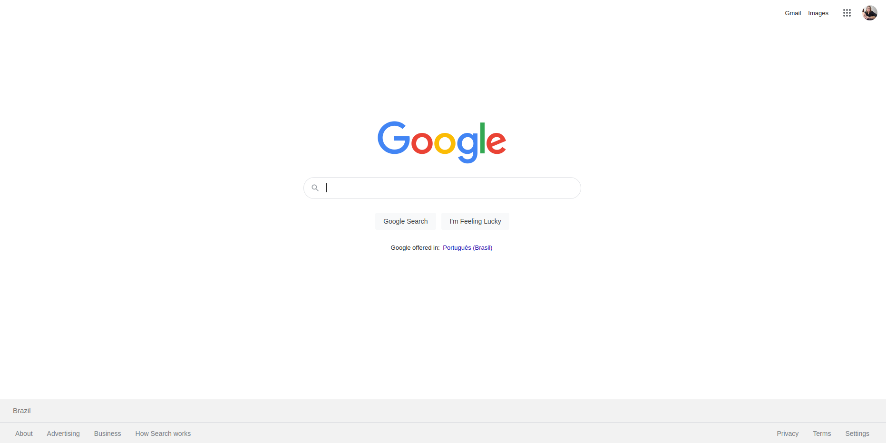
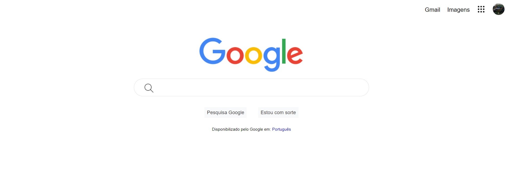

# cloneGoogle
Projeto criado para o aprimoramento de habilidades na criação de layout com HTML e CSS.

### O desafio era criar uma cópia do layout do Google

Refencia visual
 

Resultado do projeto
